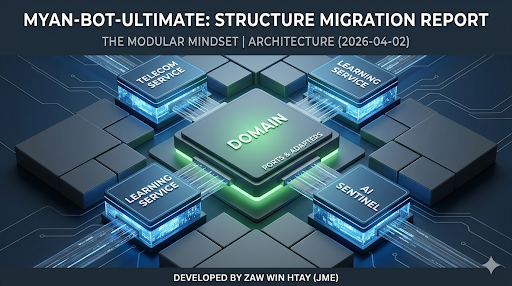

# 🏛️ Project Architecture: Mosaic Design Blueprint

 This document provide a deep dive into the ***Technical Design*** and ***Logic Flow*** of the Myan-Bot-Ultimate system.

## 🏗️ 1. Architecture Visualization (Mermaid)

 The core principle is ***Strict Decoupling***. The business logic (Service Layer) does not know about the delivery mechanism (Telegram API).
 
 ```mermaid
 graph TD
    subgraph "Delivery Layer (UI)"
        TG[Telegram Bot Handler]
        CMD[Command Dispatcher]
    end

    subgraph "Service Layer (Business Logic)"
        TS[Telecom Service]
        LS[Learning Service]
    end

    subgraph "Domain Layer (Core DNA)"
        DM[Models & Interfaces]
        REPO_INT[Repository Interfaces]
    end

    subgraph "Platform Layer (Infrastructure)"
        DB[(Firebase DB)]
        AI[Gemini AI Sentinel]
    end

    %% Dependencies Flow
    TG --> TS
    TG --> LS
    TS --> DM
    LS --> DM
    TS --> REPO_INT
    REPO_INT --> DB
    LS --> AI
```

---

## 📂 2. Directory Structure (Domain-Driven)

We follow a Modular Structure where each domain has its own boundary.

```text
~/my-go-bot-project
├── cmd/bot/main.go            # 🚀 Entry Point & Dependency Injection
├── internal/
│   ├── ai/                    # 🤖 AI Sentinel (LLM Logic)
│   ├── bot/                   # 📱 Delivery Layer (Telegram Adapters)
│   │   ├── user/              # User-facing flow
│   │   └── admin/             # System management
│   ├── domain/                # 🧬 Domain DNA (Entities & Repo Contracts)
│   │   ├── telecom/           
│   │   └── learning/          
│   ├── service/               # 🧠 Business Logic (Service Layer)
│   │   ├── telecom/           
│   │   └── learning/          
│   └── platform/              # 🔌 Infrastructure (Database & Config)
├── pkg/constants/             # 🔑 Global Single Source of Truth
└── docs/                      # 📜 Tech Documentation & Roadmaps

```

---

## 🛠️ 3. Core Technical Standards

🔹 Dependency Injection (DI)

To maintain an ***Async-First*** and ***Testable*** codebase, all services are initialized in main.go and injected into the handlers. This ensures that we can swap a database or an API without rewriting the handler logic.

🔹 Service Layer Isolation

The internal/service layer contains "Pure Go" logic. It handles validation, calculations, and data orchestration.

  - ***Telecom***: Manages phone parsing and billing logic.

  - ***Learning***: Manages educational flow and AI prompts.

🔹 AI Sentinel Integration

Unlike standard bots, AI is not a hardcoded prompt. It is a ***Modular Sentinel Service*** that interacts with the LearningService. It acts as an autonomous layer for grammar checking and programming mentorship.

---

## 🚀 4. Implementation Roadmap

 - [x] Phase 1: Domain Decoupling (Telecom & Learning separation)

 - [x] Phase 2: Service Extraction (Moving logic from Handler to Service)

 - [ ] Phase 3: AI Sentinel Deep Integration (Gemini-powered context awareness)

 - [ ] Phase 4: Automated Testing (Unit tests for Service Layers)

---

## 🧘 5. Engineering Ethics: The Green Chip Philosophy

Architecture is more than just code; it is a commitment to quality.

   - ***Modularity***: Every component is an independent "Tile."

   - ***Integrity***: Explicit error handling and clean data flow.

   - ***Scalability***: Designed to support Multi-Platform (Web/Discord) in the future.

---

**Author:** [Zaw Win Htay (Jme)](https://www.linkedin.com/in/zaw-win-htay-jme) <br>
*Backend Architect | Focusing on Modular Go Systems*
<br>
`Fri,Apr032026`
