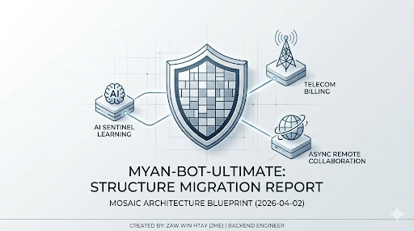
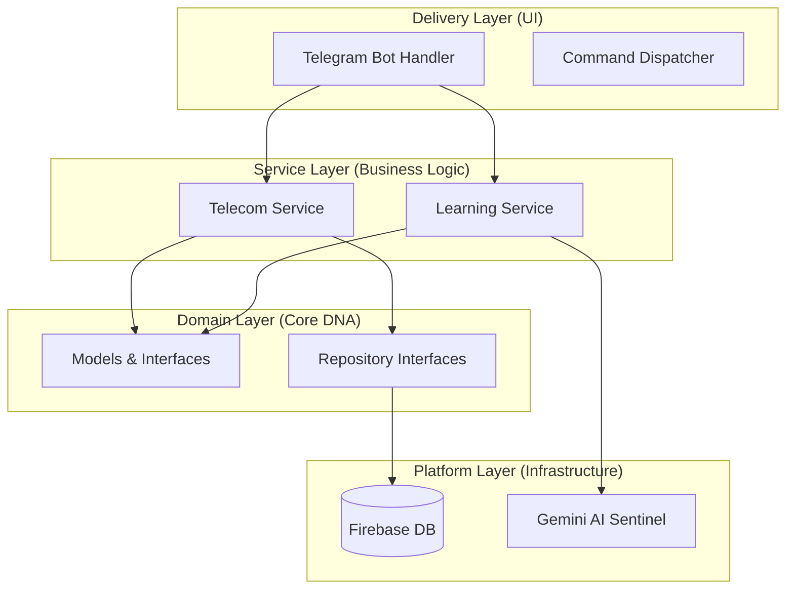

<p align="center">
  
</p>

# 🛡️ Mosaic Architecture: Myan-Bot-Ultimate Blueprint

> This repository serves as a ***Structural Blueprint*** of my core backend project. It demonstrates the transition from a monolithic script to a domain-driven, modular architecture designed for scalability, maintainability, and asynchronous remote collaboration.

---

## 🏗️ Architecture Visualization (Mermaid)

> I follow the ***Hexagonal/Clean Architecture*** principle to ensure that the Business Logic (Core) is completely decoupled from the Delivery Mechanism (Telegram Bot).



---

## 📂 Project Structure (The Tree)

- This tree reflects the current state of the project, focusing on ***Separation of Concerns***.

```text
~/my-go-bot-project
├── cmd/bot/main.go            # Orchestrator (Dependency Injection)
├── internal/
│   ├── ai/                    # AI Sentinel (LLM Integration)
│   ├── bot/                   # Delivery Layer (Telegram specific)
│   │   ├── user/              # User Flow Handlers & Menus
│   │   └── admin/             # Management Logic
│   ├── domain/                # Enterprise DNA (Models & Repo Interfaces)
│   │   ├── telecom/           
│   │   └── learning/          
│   ├── service/               # Pure Business Logic (Service Layer)
│   │   ├── telecom/           
│   │   └── learning/          
│   └── platform/              # External Drivers (DB, State, Config)
├── pkg/constants/             # Global Single Source of Truth
└── docs/                      # Technical Documentation & Roadmaps
```

---

## 🧘 My Working Philosophy: The "Async-First" Engineer

- I don't just write code; I build ***Independent Systems***. My professional approach is built on three pillars:

1. ***Architecture over Hours***: I believe a well-structured system reduces the need for constant communication. My code is documented to be self-explanatory.

1. ***Result-Oriented Collaboration***: I thrive in environments that value ***High-Quality Output*** over fixed time slots. I am a self-managed developer who owns the feature from architecture to deployment.

3. ***The Green Chip Ethic***: My work is guided by ***Integrity and Altruism***. I build tools that empower users, ensuring the code is secure, scalable, and ethically sound.

---

## 🚀 Current Project Status (Phase 1 Complete)

- [x] Multi-domain transition (Telecom & Learning)

- [x] Service Layer decoupling

- [x] Dependency Injection implementation

- [ ] AI Sentinel (Gemini) Deep Integration (In Progress)

- [ ] Automated Unit Testing for Service Layers (Next)

---

## 📩 Let's Build Something Meaningful

- I am open to ***Remote, Asynchronous, or Result-based*** collaborations where architectural quality and long-term maintainability are prioritized.

---

- [Read the Architecture Design Docs](./ARCHITECTURE.md)

---

### Contribution Guidelines

> "This is a blueprint project. Feel free to explore the architecture or reach out for discussions."

---

- **LinkedIn**: [Zaw Win Htay (Jme)](https://www.linkedin.com/in/zaw-win-htay-jme)
- **Newsletter**: [The Modular Green Chip Mindset](https://www.linkedin.com/pulse/green-chip-philosophy-why-i-build-ethics-mind-zaw-win-htay-fnhyc?utm_source=share&utm_medium=member_android&utm_campaign=share_via)
- **Email**: [zawinhtayjme@example.com]

---
*Created by: Zaw Win Htay (Jme)*